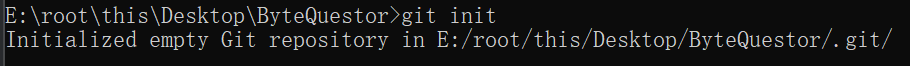
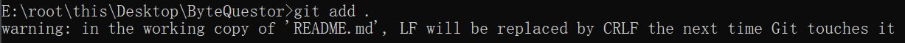
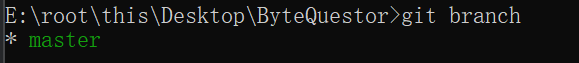
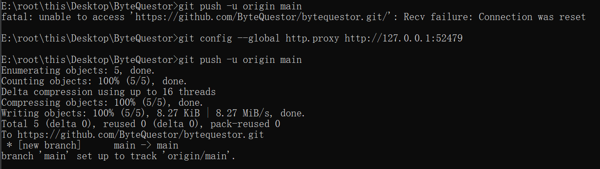

<h1>欢迎来到我的主页!</h1>

<p><font size="6"><div style="vertical-align:middle">我来自</div></font>

<p>
    <font font size="5">
      <br>我的博客地址： 
      <a href="https://bytequestor.github.io" target="_blank">ByteQuestor的博客</a>
    </font>
</p>

<h3>我在学习</h3>
<p>
  
    
  
  
  
  
  
  
  
  
  
  
  
  
  
  
  
  
  
  
  
</p>
<h3>🎁 项目</h3>
<table>
  <thead align="center">
    <tr border: none;>
  <tbody>
    <tr> 
      <td><a href="https://github.com/pzxy-cs/pzxy-cloud-competition"><b>云计算竞赛</b></a></td>
      <td></td>
      <td></td>
      <td></td>
      <td></td>
    </tr>

<tr> 
      <td><a href="https://alonelovely.github.io/"><b>大富翁游戏</b></a></td>
      <td></td>
      <td></td>
      <td></td>
      <td></td>
    </tr>

  </tbody>
</table>
 

<h3>Where to find me</h3>
<p>
  <a href="https://github.com/ByteQuestor/bytequestor" target="_blank">
  
  </a> 
</p>

-----------
===下面是第一次上传的笔记====

# 记录一下第一次上传`Github`

面板创建了仓库以后，复制仓库地址 -> https://github.com/ByteQuestor/bytequestor.git

命令看第二次提交

1，初始化仓库

````git
git init
````



2，配置远程仓库

```git
git remote add origin https://github.com/ByteQuestor/bytequestor.git
```


3，上传中转仓库

```git
git add .
```



3，提交

```git
git commit -m '这里是提交记录'
```

4，配置代理服务器（看情况，如果push不上去就配一下）

```git
git config --global http.proxy http://127.0.0.1:52479
```

5，查看本机分支名字

（因为以前用的是master，现在是main，所以出现本地和github不一样的情况也无法push）

```git
git branch
```



修改主机名字（如果是main就不用修改）

```git
git branch -m master main
git push -u origin main
```

6，将文件推送至远程仓库（含需要配置代理的情况

```git
git push -u origin main
```



